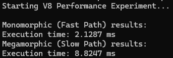

# V8 Performance Experiment: Hidden Classes & Inline Caching

This project is a technical deep-dive into how the V8 Engine optimizes JavaScript code at runtime. It specifically demonstrates the performance impact of Hidden Classes (Shapes) and the efficiency of Inline Caching (IC).

## The Theory

JavaScript is a dynamic language, but the V8 engine (used in Chrome and Node.js) optimizes it by creating "Shapes" (Hidden Classes) for objects behind the scenes.

- Monomorphism: When a function consistently receives objects with the exact same shape (same properties in the same order), V8 optimizes access via Inline Caching.
- Megamorphism: When a function receives objects with many different shapes, V8 must perform a slower, generic lookup, leading to a "Performance Penalty."

## The Experiment

This experiment compares two scenarios:

- **Scenario A (Monomorphic)**: 1,000,000 objects with the identical property order {a, b, c}.
- **Scenario B (Megamorphic)**: 1,000,000 objects with randomized property orders (e.g., {b, c, a}, {c, a, b}).

## Methodology

We use the perf_hooks (or performance.now()) API for microsecond precision. A warm-up phase is included to allow the JIT (Just-In-Time) compiler (TurboFan) to optimize the functions before measurement.

- Clone the repository:
  `git clone https://github.com/emreuzun1/v8-performance-experiment.git`
- Run the benchmark:
  `node benchmarks/inline-caching.js`

## Conclusion

The results clearly show that maintaining consistent object shapes is crucial for high-performance JavaScript. By avoiding dynamic property injection or varied property ordering, we ensure that V8 stays on the "fast path."

